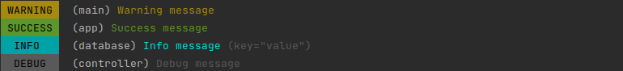

# plogr


[][releases]
[][goreport]
[][codecov]

[go-logr](https://github.com/go-logr/logr) implementation with [pterm](https://github.com/pterm/pterm)

## Usage

See [examples](./examples/example_test.go)

### Add more colors and levels

By default, only level 0 (`info`) and level 1 (`debug`) are configured.

While go-logr doesn't have names for logging levels ("info", "warning", etc), pterm does.
Both libraries agree that verbosity is increased with higher numeric logging level.
For pterm however, one could argue that their "Warning" and "Success" levels have lower verbosity than "Info".
If you like to customize the levels or styling, you could do something like this:

```go
func main() {
	sink := plogr.NewPtermSink().
	    SetLevelPrinter(3, pterm.Debug).
        SetLevelPrinter(2, plogr.DefaultLevelPrinters[0]).
        SetLevelPrinter(1, pterm.Success).
        SetLevelPrinter(0, pterm.Warning)

	logger := logr.New(sink)
	logger.V(0).WithName("main").Info("Warning message")
	logger.V(1).WithName("app").Info("Success message")
	logger.V(2).WithName("database").Info("Info message", "key", "value")
	logger.V(3).WithName("controller").Info("Debug message")
}
```



That means whenever you want to show informational messages, you'd have to set the logging level to `2` in your code base.
Alternatively, without breaking the code base, append levels like `success` to the LevelPrinters to your desired level, disregarding the verbosity increase though.
For a logging library, it remains questionable though if you'd like to maintain warnings and success levels via plogr or whether they're better explicitly invoked in pterm.

The error printer can be customized as well, but it has its own field.

[releases]: https://github.com/ccremer/plogr/releases
[codecov]: https://app.codecov.io/gh/ccremer/plogr
[goreport]: https://goreportcard.com/report/github.com/ccremer/plogr
